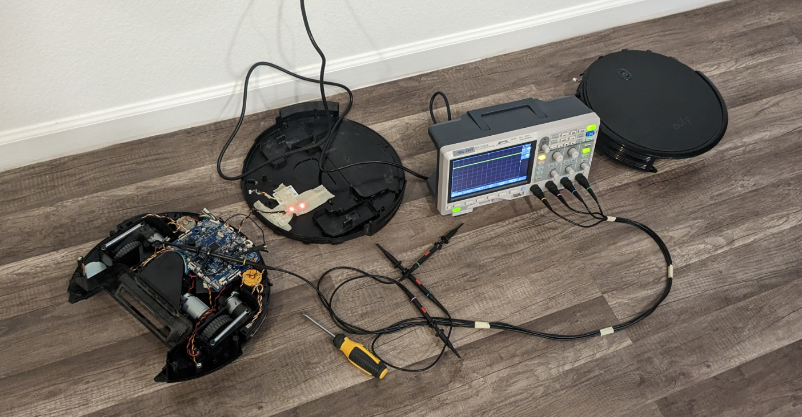

# Vacuum-V3 - Amir Gorkovchenko (Early 2023 - Mid 2023)
Successor to Vacuum V2.

### Note
Core libraries and needed files can be found in Core branch

Ever since homeassistant locked away certain features behind a paywall, a new solution was needed.

A platform called TUYA Smart allowed for developers to create an app that will communicate with a custom IOT device.

This project began simply to add wireless and smart features to a robot vacuum.
While nowadays a smart vacuum cleaner can be found easily, they can still come at a higher price.

This project gave an ordinary robot vacuum wireless control and status updates using TUYA Smart and their developer ecosystem.

Unlike Vacuum V2, this version sought to remove any need for an external gyroscope, to simplify the project.
It taps into the vacuums own sensors and mimics IR signals to control it. All data and control is handled through TUYA.

## Design
This project runs off of an arduino pro mini (Atmega328p) with an esp8266 for wireless communication.
The esp8266 is flashed and authorized using TUYA's software.

All components were soldered unto a low profile, custom PCB board through JLC PCB to improve space efficiency.

## Photos
Note the perforations between the major components, designed to easily snap off in the event there wasn't enough space for the whole board

#### Each wire directly taps into the vacuums sensores, LEDS, Button, and IR receiver

#### App interface:
Shows vacuums current status whether cleaning, charging or ready.
Also shows vacuums battery voltage to be able to estimate remaining run time
 

#### Troubleshooting
What wasn't known at first was that specific IR sensors would shutoff when the vacuum goes to sleep rendering them useless when attempting to control wirelessly. The problem was quickly resolved
